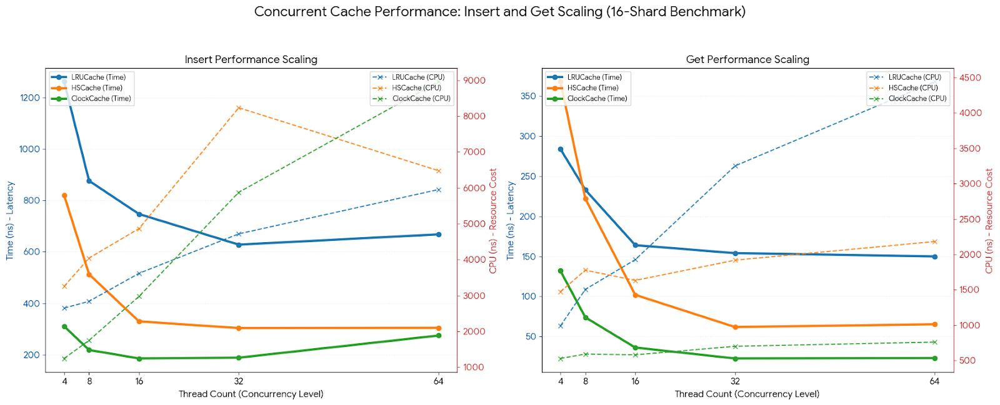
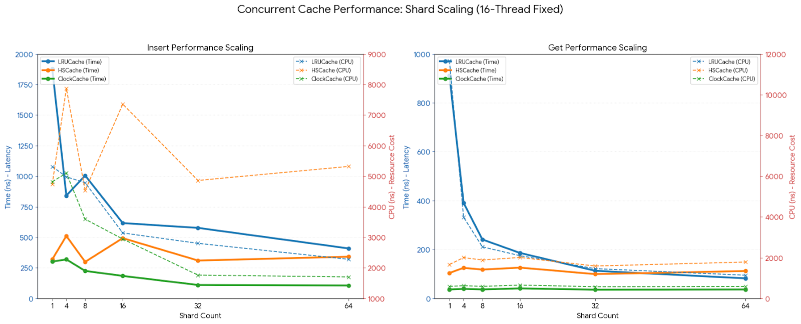
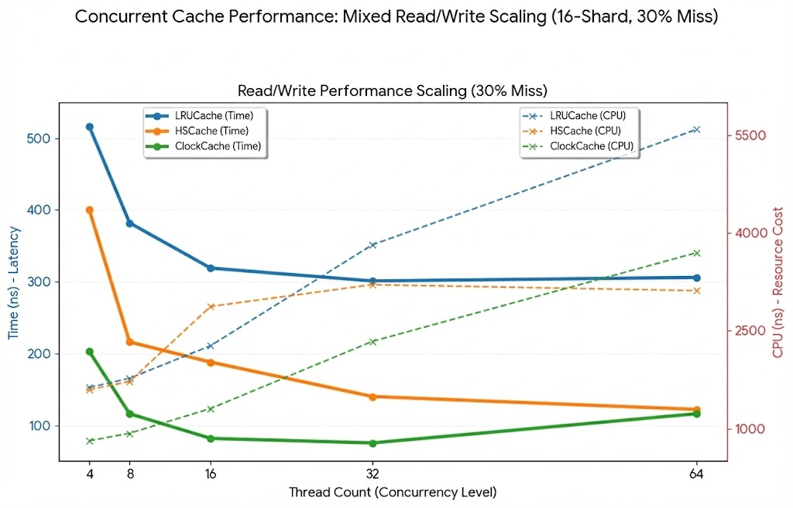
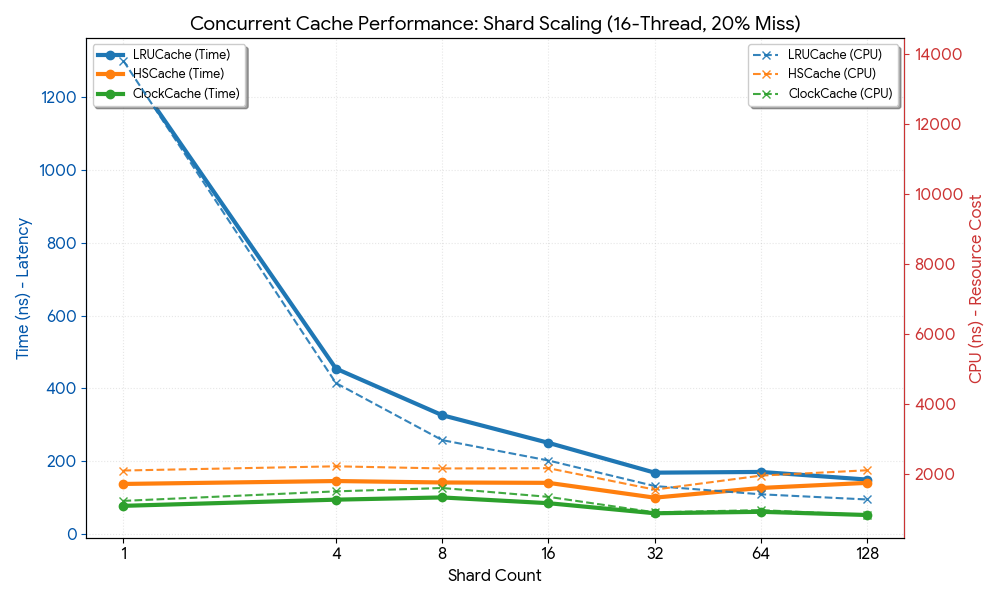
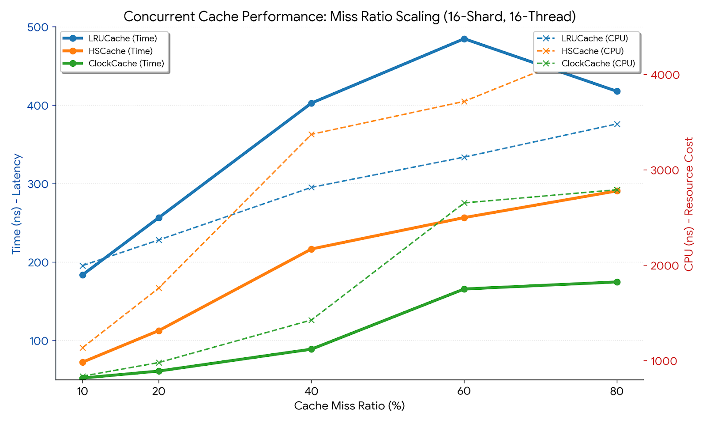

# Cache Implementations

## 🚀 Core Architectures / 核心架构

This project presents three high-performance lru cache implementations designed to address varying concurrency patterns and workload characteristics, developed primarily for research and experimental evaluation.

本项目主要用于研究与实验评估，实现了三种针对不同并发模式与负载特性的高性能lru缓存实现。

| Cache Type | Collision Resolution | Thread Safety | Key Characteristic |
| :--- | :--- | :--- | :--- |
| **LRUCache** | N/A | **Mutex** | Strict consistency baseline.   强一致性基准。 |
| **HSCache** | Chaining (Skiplist) | **Lockfree** | Optimized for high read/write throughput.   针对高并发读写优化。 |
| **ClockCache** | Open Addressing | **Lockfree** | Cache-locality optimized.   极致的 CPU 缓存局部性。 |
---

## 📖 Detailed Design / 详细设计

### 1. LRUCache (Baseline)
> **Standard Thread-Safe Implementation / 标准线程安全实现**

* **Concurrency Model**: Uses a standard **`std::mutex`**.
* **Mechanism**: Implements the classic Least Recently Used algorithm.
* **Design Rationale**: Since LRU requires mutating the internal linked list (promoting the accessed node to the head) even during `Get` operations, an exclusive lock is required for both reads and writes. This serves as a strictly serialized performance baseline for benchmarking.
* **核心机制**：采用标准**互斥锁 (Mutex)** 保证线程安全。
* **设计原理**：由于 LRU 算法在读取（Get）时也需要移动节点位置（状态变更），因此读写操作均需获取排他锁。作为性能对比的基准实现，适合强一致性要求且并发度不高的场景。

### 2. HSCache (Hybrid Skip-list Cache)
> **Atomic Skiplist Based / 基于原子跳表的结构缓存**

* **Data Structure**: A sharded hash cache where each slot maintains a **Thread-safe Skiplist**. Uses **Chaining** to resolve hash collisions.
* **Append-Only Strategy**: Nodes are strictly added and never deleted in the critical path. This eliminates complex locking overhead associated with concurrent deletions.
* **Asynchronous Maintenance**:
    * **Compaction Thread**: Performs Garbage Collection (GC) by iterating the old skiplist, copying live entries to a new one, atomically swapping the pointers, and destroying the old structure.
    * **Decay Thread**: A dedicated background thread manages entry aging and expiration (TTL), keeping the main read/write path non-blocking.
* **数据结构**：基于 `std::vector` 实现的分片哈希，每个 Slot 内部维护一个**并发安全的跳表**，即采用**拉链法**解决哈希冲突。
* **只增不删 (Append-only)**：写入路径上节点仅追加不删除，消除了并发删除带来的复杂锁竞争，极大提升了写入吞吐量。
* **异步维护**：
    * **Compaction 线程**：负责内存整理。通过将活跃节点复制到新跳表并原子替换、销毁旧跳表的方式，实现无锁化的空间回收。
    * **Decay 线程**：独立线程处理 Entry 的衰减与过期逻辑，避免阻塞主读写路径。

### 3. ClockCache (High Performance CLOCK)
> **Open Addressing & Cache Locality / 开放寻址与极致局部性**

* **Origin**: An enhanced derivative of RocksDB's `FixedHyperClockCache`, Rocksdb's HCC only support block cache.
* **Open Addressing**: Unlike the chaining approach, this implementation uses **Open Addressing** to resolve hash collisions. This layout is contiguous in memory, significantly improving **CPU Cache Locality** and reducing pointer chasing overhead.
* **Optimized Insert Path**: Modify and optimize the Insert and related logic to enhance the performance of the Insert operation.
* **算法原型**：基于 RocksDB 的 `FixedHyperClockCache` 进行深度定制与改进, Rocksdb的HCC只支持block cache。
* **开放寻址法 (Open Addressing)**：摒弃指针链表，采用开放寻址法解决哈希冲突。内存布局连续，显著提升了 **CPU 缓存局部性 (Cache Locality)**，减少cacheline miss。
* **插入路径优化**：优化了 `Insert` 逻辑，在保证安全的前提下，进一步减少了指令数，实现了极高的并发写入性能。

---

## 📊 Benchmark Performance / 性能基准测试

Conducted comprehensive benchmarks comparing **Cost**, the smaller，the better. 
进行全面的基准测试，对比了不同场景下的**Cost**，越小越好。

### 1. Separate Read/Write Operations (读写分离场景)

**Concurrency Scaling (16 Shards)**
> Evaluates performance as thread count increases. ClockCache shows superior scalability in `Get` operations. 
> 随着线程数增加的性能表现。ClockCache 在读取操作中展现了卓越的扩展性。

**Shard Scaling (16 Threads)**
> Evaluates the impact of sharding. LRUCache benefits significantly from more shards due to reduced lock contention. 
> 分片数对性能的影响。增加分片数能显著缓解 LRUCache 的锁竞争问题。

### 2. Mixed Read/Write Workloads (混合读写场景)

**Concurrency Scaling (30% Miss Ratio)**
> Performance under mixed load. ClockCache maintains low latency and CPU cost even at high concurrency. 
> 混合负载下的性能。即使在高并发下，ClockCache 依然保持极低的延迟和 CPU 开销。

**Shard Scaling (20% Miss Ratio)**
> Increasing shards effectively reduces latency for lock-heavy implementations like LRU. 
> 增加分片数有效地降低了依赖锁机制（如 LRU）的延迟。

### 3. Impact of Cache Miss Ratio (缓存未命中率的影响)

**Miss Ratio Scaling (16 Shards, 16 Threads)**
> As the miss ratio increases, CPU cost rises across all caches. ClockCache demonstrates the best resilience. 
> 随着未命中率的增加，所有缓存的 CPU 开销都会上升。ClockCache 表现出了最好的适应性。

